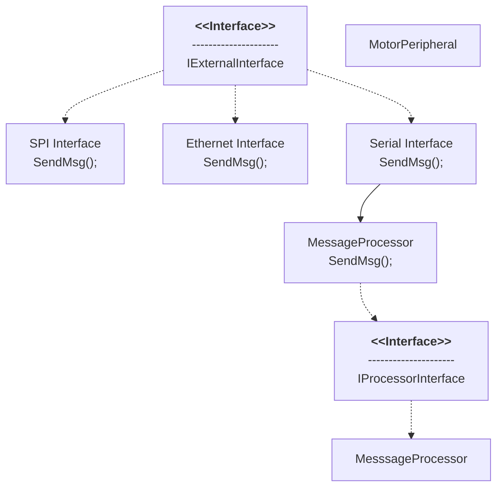
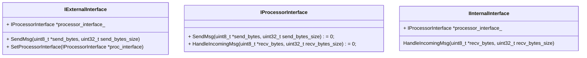

# Software Architecture #

I know this code looks complex, but its visual complexity enables the long list of control interfaces, peripherals, and functionality. Heres a diagram of roughly how ot works.

  